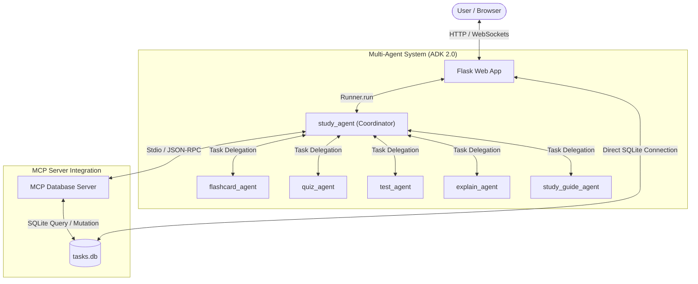

# 🐸 frogGPT — Study, Relax & Hop

Welcome to **frogGPT**, a cozy and aesthetic productivity web application designed to help you stay focused, manage tasks, and study alongside Lily, your study-frog mascot.

---

## 🌟 Features

### ⏰ 1. Pond Pomodoro Timer
* **Fully Customizable:** Adjust your work duration, break duration, and total target number of sessions.
* **Cozy Status Tracker:** Keeps track of your active focus cycles and alerts you when it's time to take a break or start studying again.
* **Animated Progress Circular Ring:** Smoothly visualizes the remaining time.

### 📋 2. "Tasks to Hop On" (To-Do List)
* **Due Dates:** Assign specific target dates to tasks to help plan your schedule.
* **Cozy Categorization:** Label tasks as **School** or **Work**, or click `+` to add custom categories. Custom categories are automatically color-coded with unique pastel badges.
* **Urgency Levels:** Label tasks as **Low** 🟢, **Medium** 🟡, or **High** 🔴 urgency to identify priority items at a glance.
* **Sorting & Filters:** Sort your list by due date (earliest/latest) or urgency (high/low first), and filter items by category.
* **Persistent Storage:** Syncs automatically with the Flask backend or uses Guest Mode local storage.
* **🌸 Spring Flower Completion:** Checking off a task displays a beautiful pink spring flower emoji (🌸) and soft matching pink border instead of a generic checkmark, accompanied by a happy croak from Lily.

### 📅 3. Lily's Monthly Calendar (Full-Page Split Workspace!)
* **Full-Page Centered Overlay:** Opened via the calendar icon (`📅`) in the left panel sidebar. Takes up a large centered viewport overlay (92vw width, 90vh height).
* **Month at a Glance:** View all tasks plotted on a month grid, complete with color-coded urgency flags.
* **Click-to-Select Day Events:** Click any calendar day cell to instantly view all events/tasks scheduled for that day in the side inspector, and quickly check them off/complete them with 🌸 checkboxes directly in the sidebar list.
* **Inline Custom Categories:** Directly type and add custom categories within the calendar quick-add form. Newly created categories are automatically saved and synced across all task selectors.
* **Previous/Next Controls:** Seamlessly navigate between months using the left and right indicators.
* **Current Day Highlight:** Today's date is automatically highlighted with a cozy mint green border.
* **Direct Add Calendar Items:** Easily add new events or tasks directly inside the calendar quick-add form.

### 🎮 4. Cozy Game Arcade & Study Games (Full-Page Playground!)
* **Cozy Destress Games:** Accessed via the game controller icon (`🎮`) in the left panel sidebar. Takes up the full viewport window.
* **frogGPT 2048 Theme:** Play a cozy themed version of the classic 2048 game using custom pastel colors, culminating in a special **"2048 🐸"** tile.
* **Matching Study Game:** Match terms and definitions from your selected deck side-by-side in a race against time! Cards automatically fade when matched.
* **Asteroid Blaster Study Game:** Aim and blast arriving asteroids containing definitions by matching them with the correct term loaded on your blaster.
* **Saves High Score:** Automatically saves your highest score locally (`bestScore2048` stored in `localStorage`).

### 📻 5. frogGPT Pond Radio (Spotify Integration)
* **Curated Stations:** Quick-switch between four pre-configured ambient playlists (Lofi Focus Beats, Peaceful Piano, Nature Rain Sounds, and Nintendo & Chill).
* **Load Custom Music:** Paste any Spotify track, album, or playlist link to load it dynamically into the built-in media widget.
* **Animated Interactions:** When music starts playing, Lily puts on headphones, bobs her head to the beat, and floating music notes drift across the screen!

### 🌧️ 6. Ambient Sound Engine (Web Audio API)
* Includes built-in custom client-side synthesizers.
* Toggle gentle rain (low-passed white noise), forest rustles (band-passed brown noise with LFO modulation), and organic frog croaking chimes.

### ☁️ 7. Account & Synchronization (SQLite & Cloud Sync)
* **Cross-Device Sync**: Sync your tasks and pomodoro settings across multiple devices using a simple username & password account.
* **Guest Mode Fallback**: If not logged in, the app operates in offline Guest Mode, securely storing your tasks in the browser's `localStorage`.
* **Zero-Config Sync**: Once logged in, your progress is automatically saved to and retrieved from the Flask backend server.

### 🤖 8. frogGPT AI Study Agent & Study Decks (Full-Screen Workspace!)
* **Personal Study Mascot:** Accessed via the robot/chat icon (`🤖`) in the left panel sidebar.
* **Full-Screen Workspace with Three-Way Toggle:** A full-viewport layout equipped with a header toggle to customize your workspace:
  * **💬 Chat Only:** Focuses exclusively on your conversation with Lily for instruction and query inputs (100% width).
  * **📚 Materials Only:** Expands the interactive study playground (flashcards, quizzes, tests, study guides) to full-screen width for distraction-free learning.
  * **🔀 Split Screen:** Displays both the chat window and interactive materials side-by-side.
* **📚 Two-Column Flashcard Library Explorer:** Lists all your decks in a clean left-side panel. Selecting a deck displays its title, description, term count, and lets you start a study session, or launch study games directly with that deck.
* **✏️ Full-Page Flashcards Editor:** Create or edit custom decks inside a spacious modal layout with auto-resizing text fields for long concepts and definitions.
* **Persistent Session History:**
  * If logged in, users can click **"📜 Session History"** to list, load, and resume past study conversations.
  * Users can click **"➕ New Chat"** to clear the conversation log and spin up a clean study session.
* **Interactive Study Playgrounds:**
  * **Interactive Flashcards:** View cards, click to flip with a 3D perspective transition, star cards (`☆`/`★`) to bookmark, and shuffle decks using a Fisher-Yates generator.
  * **Interactive Quizzes:** Answer multiple-choice questions with color-coded feedback and view final scores.
  * **Graded Practice Tests:** Complete True/False, Multiple-Choice, and Short Answer exams with sample answers and detailed score lists.
* **Multi-Format Document Imports:** Click the attachment icon (`📎`) to upload `.txt`, `.md`, `.docx`, or `.pdf` documents to generate personalized study decks.

### 🗒️ 9. frogNote Agent (AI Note Taker)
* **Compact Viewport Optimization**: Designed with a tight modal layout fitting completely within the browser window to avoid vertical scrolling.
* **Multi-Input Transcription**:
  * **Voice Recording**: Record lectures or meetings live with a dynamic remaining time limit indicator (5 minutes per remaining daily call).
  * **Local Uploads**: Upload audio and video files (supporting `.mp3`, `.wav`, `.m4a`, and `.mp4` files) with automated metadata parsing.
  * **URL Imports**: Download and transcribe YouTube videos natively using Gemini multimodal execution.
* **Client-Side Safety Checks**:
  * Blocks files larger than `25MB` to prevent gateway failures against Cloud Run's strict 32MB payload limit.
  * Dynamically handles video metadata via `video` DOM elements.
* **Document Export**: Transcribe, summarize, and export structured lecture/meeting notes as formatted Word Documents (`.docx`) or PDFs (`.pdf`).

### 📊 10. Server-Side Daily Quota Database & Timezone Tracking
* **Daily Free Quota Limit**: Restricts API calls to **20 queries/day** (shared across frogGPT and frogNote agents) enforced persistently on the server via a SQLite `daily_quota_calls` table.
* **Browser Local Timezone Reset**: Attaches a custom `X-Client-Date` header to requests. The Flask server extracts this header to match local timezone dates instead of the Cloud Run UTC system clock, ensuring midnight resets align with the user's timezone.
* **Model-Not-Supported Detection**: Gracefully parses rate limits and model mismatch errors, directing users to switch to available Gemini 2.5 Flash or Pro models.
* **503 High Demand Catching**: Detects `503 Service Unavailable` exceptions from Google AI Studio and formats them separately from quota exhaustion events.

---

## 🛠️ Tech Stack

* **Backend:** Python, Flask, SQLite, Gunicorn (production web server)
* **Frontend:** Vanilla HTML5, Vanilla CSS3 (Glassmorphism, custom layouts), Vanilla JavaScript (ES6)
* **Database & Cloud Storage:** Google Cloud Storage (GCS) mounted via Cloud Storage FUSE (for persistent tasks storage)
* **Deployment Platform:** Google Cloud Run (containerized server running 24/7)
* **Audio:** Web Audio API (Synthesized noises and chimes)
* **Music Integration:** Spotify Web Player Embed API
* **AI Orchestrations:** Google Agent Development Kit (ADK 2.0) multi-agent coordinator
* **Document Parsers:** `python-docx` (Word Documents) and `pypdf` (PDF files)

---

## 🚀 Setup & Installation

### Prerequisites
Make sure you have Python 3 installed on your system.

### Running the App Locally

1. **Clone or Navigate to the directory:**
   ```bash
   cd /Users/makaelaharrell/agy-cli-projects/frogGPT
   ```

2. **Install Dependencies:**
   ```bash
   python3 -m pip install -r requirements.txt
   ```

3. **Start the Flask Server:**
   ```bash
   python3 main.py
   ```

4. **Access the Web App:**
   Open your browser and navigate to **[http://127.0.0.1:5001](http://127.0.0.1:5001)**.

### ☁️ Cloud Deployment (Google Cloud Run)

The application is deployed to Google Cloud Run and operates 24/7. You can access it directly at:
**👉 [https://froggpt-170395053839.us-central1.run.app](https://froggpt-170395053839.us-central1.run.app)**

To deploy your own copy of the app:

1. **Prerequisites**: Make sure you have the Google Cloud SDK installed and authenticated.
2. **Enable APIs**: Enable Cloud Run, Cloud Build, and Cloud Storage APIs.
3. **Create GCS Bucket**: Create a GCS bucket to store your SQLite database.
4. **Deploy**:
   ```bash
   gcloud run deploy froggpt \
     --source . \
     --region us-central1 \
     --execution-environment gen2 \
     --add-volume name=tasks-db-volume,type=cloud-storage,bucket=YOUR_GCS_BUCKET \
     --add-volume-mount volume=tasks-db-volume,mount-path=/data \
     --set-env-vars DB_PATH=/data/tasks.db \
     --allow-unauthenticated
   ```

---

## 🏛️ System Architecture

frogGPT is designed as a modular, decoupled application separating the user-facing web layer, the agentic reasoning coordinator, and the secure data-access layer.



### Component Breakdown
1. **Frontend / Flask App (`main.py` / `templates` / `static`)**: Manages the Pomodoro timer state machine, Spotify audio sync, Web Audio sounds, and provides a cozy Web UI. It forwards chat requests to the ADK `Runner` and automatically maps user sessions.
2. **ADK Coordinator (`study_agent`)**: The central routing node. Depending on the intent, it either invokes sub-agents to generate study materials or communicates with the database MCP server to perform task/timer updates.
3. **MCP Database Server (`study-agent/app/mcp_server.py`)**: Exposes the SQLite database as structured tools using the Model Context Protocol standard over `stdio`.
4. **Specialist Sub-agents (`agent.py`)**: Multi-turn task-mode agents that convert text/notes into structured schemas (flashcards, quizzes, tests, study guides).

---

## 🎓 Applied Key Concepts (Course Requirements)

We have implemented and demonstrated the following core concepts from the Google & Kaggle AI Agents Intensive Course:

### 1. Agent & Multi-agent System (ADK) — Demonstrated in [agent.py](file:///Users/makaelaharrell/agy-cli-projects/frogGPT/study-agent/app/agent.py)
* Built using the **Google Agent Development Kit (ADK 2.0)**.
* Implements a **coordinator/specialist topology** where the coordinator (`root_agent`) processes natural language requests and delegates structured generation tasks (`mode="task"`) to one of five sub-agents:
  * `flashcard_agent` (structured active recall Q&As)
  * `study_guide_agent` (topic maps & definitions)
  * `quiz_agent` (multiple-choice assessments)
  * `test_agent` (practice tests with mixed format)
  * `explain_agent` (simplifications and metaphors)

### 2. MCP Server (Model Context Protocol) — Demonstrated in [mcp_server.py](file:///Users/makaelaharrell/agy-cli-projects/frogGPT/study-agent/app/mcp_server.py)
* Developed a custom Python MCP server using the official **FastMCP SDK**.
* The server exposes database query and mutation interfaces as standardized tools:
  * `get_user_tasks` (retrieves a user's items)
  * `create_user_task` (adds a new item to SQLite)
  * `complete_user_task` (marks a task complete)
  * `get_pomodoro_stats` (aggregates Pomodoro logs)
* The ADK agent connects to this server dynamically as an **MCP Client** using `StdioConnectionParams` and `StdioServerParameters`, launching the server as a subprocess and utilizing standard JSON-RPC communication.

### 3. Security Features — Demonstrated in [main.py](file:///Users/makaelaharrell/agy-cli-projects/frogGPT/main.py) & [mcp_server.py](file:///Users/makaelaharrell/agy-cli-projects/frogGPT/study-agent/app/mcp_server.py)
* **Hashed Authentication**: User passwords are saved and validated using secure scrypt hashing (`generate_password_hash` / `check_password_hash` from `werkzeug.security`).
* **Input Sanitization**: The MCP database tools validate and sanitize all user-supplied query text (`sanitize_string`) to mitigate SQL injection vectors.
* **Access Control / Ownership Checks**: DB mutations enforce strict ownership rules (`WHERE id = ? AND user_id = ?`) to prevent Horizontal Privilege Escalation (e.g. preventing users from deleting other users' tasks).
* **Zero Hard-coded Secrets**: API keys (`GOOGLE_API_KEY`) and paths (`DB_PATH`) are loaded dynamically through environment variables and `.env` files.

### 4. Agent Skills — Demonstrated in [google-agents-cli-workflow](file:///Users/makaelaharrell/.agents/skills/google-agents-cli-workflow/SKILL.md) & [google-agents-cli-adk-code](file:///Users/makaelaharrell/.agents/skills/google-agents-cli-adk-code/SKILL.md)
* Utilized file-based agent skills (`skill.md` patterns) via the **Google Agent CLI (`agents-cli`)** to manage prompt layouts, run local lints, evaluate results, and structure code.

---

## 📂 File Structure

* `main.py` — Flask server and SQLite REST API endpoints.
* `templates/index.html` — Main layout.
* `static/css/style.css` — Custom styles, animations, and responsive layout.
* `static/js/app.js` — Timer state machine, Spotify link parser, and audio synthesis engine.
* `static/images/study_frog.jpg` — Cute generated vector illustration of Lily the study frog.
* `requirements.txt` — Python libraries (Flask).
* `.gitignore` — Ignores local databases, caches, and configuration scripts.
* `study-agent/` — ADK 2.0 multi-agent implementation (coordinator, sub-agents, schemas, tests).
